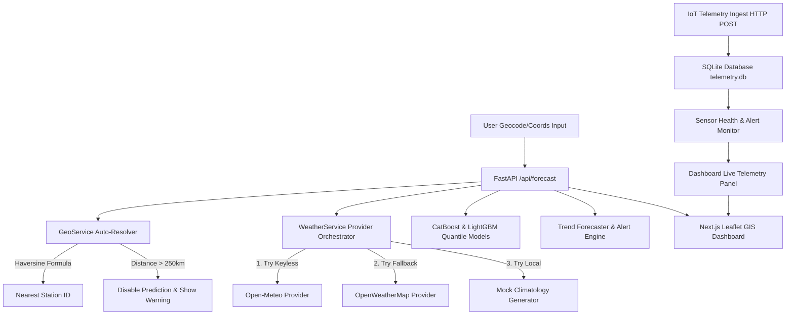

# NEERA Production Hydrology Integration Report

This report documents the integration architecture, keyless/fallback weather service refactoring, SQLite IoT sensor ingestion grid, geolocation autocompletes, production-ready logging, and Next.js Leaflet UI modifications.

---

## 1. System & Ingest Architecture



---

## 2. API References & Integrations

The platform integrates three categories of services:

### 2.1 Geographic & Search Services (Nominatim)
- **Autocomplete Suggestions**: Exposes `GET /api/geocode/autocomplete?query=QUERY`. Validates length (rejects < 3 characters) and biases queries to the Karnataka, India bounding box (`countrycodes=in`, `viewbox=74.0,11.0,79.0,19.0`) for highly relevant localized civic search.
- **Geocoding & Reverse Geocoding**: Exposes `GET /api/geocode` and `GET /api/reverse-geocode`. Translates location queries to coordinates and vice versa.
- **Nearest Telemetry Station**: Exposes `GET /api/nearest-station`. Resolves the nearest groundwater station and flags `disable_prediction: true` if the geodesic distance exceeds **250 km**.

### 2.2 Refactored Weather Service Providers
- **Open-Meteo Provider**: The primary, free, keyless weather forecast engine. Returns current temperature, relative humidity, wind speeds, cloud cover, WMO weather code mapped condition names, hourly forecasts, and 5-day outlooks.
- **OpenWeatherMap Provider**: The secondary fallback provider. Activates automatically if `OPENWEATHER_API_KEY` is set in the environment and Open-Meteo experiences timeouts.
- **Orchestration & Caching**:
  - Implements an exponential backoff retry loop (3 attempts).
  - Caches query coordinates for 1 hour (`outputs/cache/weather/*.json`) to avoid rate limits and reduce API latencies.

### 2.3 SQLite IoT Sensor Telemetry
Exposes a real database persistence layer for monitoring grids:
- **`POST /api/sensors/ingest`**: Receives Pydantic-validated JSON payloads:
  ```json
  {
    "sensor_id": "iot-020109b",
    "lat": 16.83,
    "lon": 75.71,
    "water_level": 12.35,
    "battery": 95,
    "temperature": 27.2,
    "humidity": 62,
    "timestamp": "2026-05-26T03:00:00Z"
  }
  ```
  Auto-registers new sensors by mapping them to their closest station ID on first ingestion.
- **`GET /api/sensors/latest`**: Returns all registered sensors with their calculated health diagnostics:
  - `status`: `online` or `offline` (if `last_seen` > 24 hours ago).
  - `alerts`: Triggers low battery warning flags (`battery < 20%`) or stale sensor warnings.
- **`GET /api/sensors/history`**: Returns historical telemetry charts data for a specific sensor.

---

## 3. Productionization & Reliability

1. **Environmental Security**: Loaded configuration via `python-dotenv`. Added `.env.example` templates and updated `.gitignore` rules to prevent credentials leakage.
2. **Structured Rotating Logging**: Setup a file rotation logging engine (`outputs/logs/neera.log`) writing in structured JSON lines for automated tools parsing:
   `{"timestamp": "2026-05-26 08:30:15", "level": "INFO", "message": {"type": "request_timing", "path": "/api/forecast", "duration_ms": 42.15}}`
3. **Request Timing Middleware**: Logs route execution time in milliseconds and appends `X-Process-Time-Ms` in HTTP headers.
4. **Graceful Exception Interceptors**: Added global middleware catching internal server errors and returning localized JSON structures, hiding traceback leaks in production.

---

## 4. UI Dashboard Capabilities

Refactored the Next.js frontend into a civic drought warning SaaS:
- **Connected Search Dropdowns**: Added debounced autocomplete dropdowns showing locations in Karnataka.
- **GPS Coordinates Lookup**: Users can click "Use My Location" to locate active coordinates.
- **Interactive GIS Map**: Circle markers are drawn via Leaflet and colored green/orange/red according to the predicted alert levels (`SAFE`, `MODERATE`, `WARNING`, `CRITICAL`).
- **Telemetry Console & SQLite panel**: Allows users to toggle "Stream Telemetry" which pushes real POST data into the SQLite database and displays active sensor indicators.

---

## 5. Deployment Instructions

### Local Manual Launch
1. Configure environment variables in `.env` file:
   ```bash
   cp .env.example .env
   # Add OPENWEATHER_API_KEY (optional)
   ```
2. Start the FastAPI backend:
   ```bash
   .venv/bin/pip install -r requirements.txt
   .venv/bin/uvicorn app:app --port 8000
   ```
3. Launch NextJS:
   ```bash
   cd frontend
   npm install
   npm run dev
   ```

### Docker Compose Multi-Container Setup
1. Launch the entire integrated environment:
   ```bash
   docker-compose up --build
   ```
2. Open dashboard: `http://localhost:3000`
3. Backend docs: `http://localhost:8000/docs`
