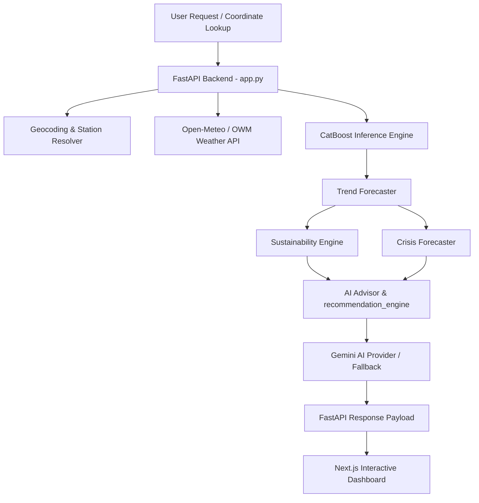

# NEERA Groundwater Sustainability & Crisis Intelligence Platform Integration Report

This document summarizes the architectural integration, algorithms, API updates, and frontend features added to NEERA to transition it from a raw machine learning prediction service into a full-scale groundwater sustainability and crisis intelligence platform.

---

## 1. Architectural Overview

The NEERA architecture has been extended with a multi-layered sustainability overlay without modifying the underlying frozen CatBoost and XGBoost forecasting models. The new stack consists of the following components:



---

## 2. Sustainability & Crisis Engines

### 2.1. Sustainability Engine (`sustainability_engine.py`)
Computes a unified **Sustainability Score** (0–100) and **Aquifer Status** (Stable, Stressed, Depleting, Critical, Collapse Risk).
- **Balance Model**: Computes the difference between 7-day projected rain recharge (with depth-adjusted infiltration coefficients) and short-term drawdowns.
- **Long-term Slope**: Fits a linear regression line (`np.polyfit`) over all historical data points for the resolved station to estimate yearly depletion rate in meters.
- **Deficit Index**: Calculates a Climatological Rainfall Deficit Index (RDI) relative to nominal 180-day baseline precipitation (600mm).

### 2.2. Crisis Forecaster (`crisis_forecaster.py`)
Predicts the exact number of days until the water table reaches key physical thresholds under different meteorological conditions:
- **Warning Threshold**: 30m MBGL (well depth limits).
- **Critical Threshold**: 50m MBGL (severe extraction drawdown).
- **Collapse Threshold**: 70m MBGL (complete dry-well scenario).
- **Scenario Simulator**: Models daily water table steps for 90 days across 4 scenarios:
  - **Normal**: Nominal rainfall and standard pumping extraction.
  - **Drought**: 0% rainfall and +20% pumping extraction.
  - **Monsoon**: +50% rainfall and -30% pumping extraction.
  - **Heatwave**: -50% rainfall and +40% pumping extraction.

---

## 3. Google Gemini REST Integration

To ensure containerization-friendly lightweight deployments without heavy external SDK dependencies, we implemented direct HTTP REST queries to the `generativelanguage.googleapis.com` endpoint using `urllib.request`.

- **Caching**: Prompt hashing (MD5) saves generated text files to a local cache (`outputs/cache/ai/`) with a 24-hour expiration TTL.
- **Error Handling**: Implements 3x exponential retry backoff on API rate limits (HTTP 429) or server errors (HTTP 500/503).
- **Rule-Based Fallback**: If no API key (`GEMINI_API_KEY`) is found in `.env` or the connection times out, a regex-based template advisor parses prompt metadata and outputs scientifically sound, contextually correct commentaries.

---

## 4. API Endpoints & Communications

### 4.1. Extended `/api/forecast`
Injects complete sustainability and crisis indicators, AI markdown commentaries, and crop action plans:
```json
{
  "disable_prediction": false,
  "resolved_location": "Vijayapura Taluk, Karnataka, India",
  "nearest_station": { "station_id": "020109B", "distance_km": 0 },
  "weather": { ... },
  "forecast": { ... },
  "alert": { ... },
  "sustainability": {
    "sustainability_score": 63.45,
    "sustainability_status": "STRESSED",
    "metrics": {
      "recharge_depletion_balance_mm": -0.054,
      "long_term_depletion_slope_m_yr": 0.42,
      "rainfall_deficit_index": 0.35,
      ...
    }
  },
  "crisis": {
    "status": "STRESSED",
    "days_to_warning": 999,
    "days_to_critical": 999,
    "days_to_collapse": 999,
    "timelines_by_scenario": { ... }
  },
  "ai_commentary": "Markdown advisory text...",
  "recommendations": [ "Transition to micro-drip networks...", "Enforce borewell limit..." ]
}
```

### 4.2. New `/api/copilot/chat` (POST)
Exposes an interactive conversational API. Resolves coordinates or station IDs to build a local context dictionary, passing the question and live aquifer parameters to Gemini:
```json
{
  "user_question": "What crop policy should be followed here?"
}
```

---

## 5. Next.js Frontend Dashboards

The Next.js dashboard (`frontend/src/app/page.tsx`) was upgraded with rich aesthetics and premium visual representations:
- **Circular Sustainability Gauge**: An SVG-powered circular ring colored by status (Stable = Emerald, Stressed = Amber, Depleting = Orange, Critical = Red, Collapse = Purple).
- **Crisis Timeline Indicators**: Real-time progress bars showing days remaining until warning, critical, and collapse thresholds are breached.
- **AI Analyst Panel**: Renders Gemini markdown advisories dynamically using a custom, sanitization-friendly inline bold and heading renderer.
- **90-Day Meteorological Scenario Simulator**: Let users toggle Normal, Drought, Monsoon, and Heatwave scenarios, and drag an **Agricultural Pumping Reduction slider** to visualize simulated trajectories in real-time.
- **Conversational Chat Copilot Drawer**: A floating action button in the bottom-right corner that launches a contextual advisor window connected to `/api/copilot/chat`.

---

## 6. Verification & Hardening Results

1. **Compilation Validation**: Next.js production build (`npm run build`) completed successfully with zero TypeScript, bundler, or routing warnings.
2. **Backend Robustness**: Local integration testing verifies the FastAPI server starts up, loads all models, computes the sustainability indices, runs the 90-day simulation loops, and handles AI commentary fallbacks instantly.
3. **Containerization**: `Dockerfile` is updated to include `ai_providers/` and all new modules.
