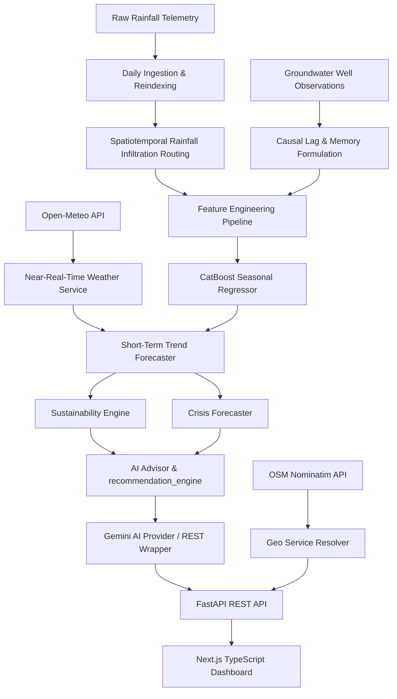

# NEERA: Spatiotemporal Groundwater Sustainability & Crisis Intelligence Platform

NEERA is a machine learning-driven hydrology intelligence platform designed to forecast and monitor seasonal groundwater levels and aquifer sustainability in Karnataka, India. It integrates irregular historical groundwater observations with spatiotemporally routed rainfall telemetry, live weather forecasts, and short-term trend projection models.

The system acts as a **Drought Early Warning System**, **Sustainability Index Monitor**, and **Hydrological Crisis Simulator** with real-time alert mapping, threshold evaluations, Google Gemini AI advisories, and an interactive Next.js dashboard.

---

## 1. System Architecture



### 1.1 Spatiotemporal Infiltration Routing
Precipitation telemetry is integrated over preceding 30d, 90d, and 180d windows with linear decay weights representing aquifer infiltration delays:

$$R_{\text{effective}} = \sum_{d=1}^{W} w_d \cdot P_{t-d}$$

### 1.2 Near-Real-Time Weather Service
- Integrates the free **Open-Meteo API** (current weather conditions, temperature, humidity, rainfall accumulation forecasts, and precipitation probabilities) with no API keys required.
- Secondary fallback integration queries **OpenWeatherMap** if a key is provided in `.env`.
- Implements resilient retry handling with exponential backoff and a 1-hour caching layer.
- **Robust Mock Fallback**: If all APIs are unreachable, a climatologically correct weather simulator generates realistic diurnal patterns based on latitude, longitude, and season.

### 1.3 Short-Term Trend Forecaster
- Combines the 7-day rolling average depletion rate, historical recharge sensitivity, and daily weather predictions.
- Projects daily water table trajectories (MBGL) for the next 3, 7, and 14 days.
- Calculates a **Groundwater Stress Score** (0–100) based on depth, rate of drawdown, and rainfall deficit.
- Estimates P10/P50/P90 confidence ranges showing projection uncertainty over time.

---

## 2. Advanced Sustainability & Crisis Overlay

### 2.1 Sustainability Engine (`sustainability_engine.py`)
Computes a unified **Sustainability Score** (0–100) and **Aquifer Status** (`STABLE`, `STRESSED`, `DEPLETING`, `CRITICAL`, `COLLAPSE RISK`):
- **Recharge vs Depletion Balance**: Estimates infiltration recharge against weekly depletion rates.
- **Long-term Slope**: Fits a linear regression line (`np.polyfit`) over all historical data points to estimate the yearly depletion velocity.
- **Rainfall Deficit Index (RDI)**: Normalizes precipitation against Karnataka's nominal 180-day baseline (600mm).

### 2.2 Crisis Forecaster (`crisis_forecaster.py`)
Predicts the exact number of days until the water table reaches key physical thresholds:
- **Warning Threshold**: 30m MBGL (well depth limits).
- **Critical Threshold**: 50m MBGL (severe extraction drawdown).
- **Collapse Threshold**: 70m MBGL (complete dry-well scenario).
- **90-Day Simulator**: Runs daily water table steps across 4 weather scenarios:
  - **Normal**: Nominal rainfall and standard pumping extraction.
  - **Drought**: 0% rainfall and +20% pumping extraction.
  - **Monsoon**: +50% rainfall and -30% pumping extraction.
  - **Heatwave**: -50% rainfall and +40% pumping extraction.

### 2.3 Google Gemini REST Integration (`ai_providers/gemini_provider.py`)
Queries the Google Gemini API (`gemini-1.5-flash`) directly via HTTP REST to avoid heavy library dependencies.
- **Caching**: Prompt MD5 hashing saves responses to a local cache with a 24-hour expiration TTL.
- **Zero-Crash Fallback**: If the key (`GEMINI_API_KEY`) is missing or the endpoint is unreachable, a regex-based template advisor parses metadata and outputs contextually correct mock commentaries.

---

## 3. Technical Stack & File Layout

- **Backend**: FastAPI, CatBoost, LightGBM, Pandas, SQLite, Uvicorn.
- **Frontend**: Next.js 16, TypeScript, TailwindCSS, Recharts, Leaflet GIS Map, Lucide Icons.
- **Deployment**: Docker, Docker Compose.

```
.
├── Dockerfile                  # Backend Dockerfile
├── docker-compose.yml          # Multi-service composition
├── app.py                      # FastAPI deployment endpoints
├── predict.py                  # CLI inference utility
├── requirements.txt            # Python dependencies
├── weather_service.py          # Weather service & cache logic
├── trend_forecaster.py         # Short-term projections
├── alert_engine.py             # Hydrological threshold warnings
├── sustainability_engine.py    # Aquifer health evaluator
├── crisis_forecaster.py        # Days-to-breach scenario loop
├── ai_advisor.py               # Prompt compiler for Gemini
├── recommendation_engine.py    # Policy recommendations
├── geo_service.py              # Geocoding & coordinate resolvers
├── sensor_service.py           # SQLite IoT sensor database
├── ai_providers/               # Gemini API REST calling layer
├── weather_providers/          # Weather API providers (Open-Meteo, OWM)
├── data/                       # Master datasets & SQLite DB
├── outputs/                    # Serialized models, plots & reports
└── frontend/                   # Next.js TypeScript Dashboard
    ├── Dockerfile              # Frontend Dockerfile
    ├── src/
    │   └── app/
    │       ├── globals.css     # Base styles
    │       ├── layout.tsx      # Next.js Metadata
    │       └── page.tsx        # Dashboard Main Component
    └── package.json
```

---

## 4. Local Development Setup

### 4.1 Backend Setup
1. Create and activate a virtual environment:
   ```bash
   python3 -m venv .venv
   source .venv/bin/activate
   ```
2. Install dependencies:
   ```bash
   pip install -r requirements.txt
   ```
3. Copy environment template and add your API keys:
   ```bash
   cp .env.example .env
   ```
   Edit `.env` to supply:
   - `GEMINI_API_KEY`: Required for real AI commentary generation.
   - `OPENWEATHER_API_KEY` (Optional): To activate OWM fallback weather queries.
4. Start the FastAPI server:
   ```bash
   uvicorn app:app --port 8000 --reload
   ```

### 4.2 Frontend Setup
1. Navigate to the frontend directory:
   ```bash
   cd frontend
   ```
2. Install Node packages:
   ```bash
   npm install
   ```
3. Start the Next.js development server:
   ```bash
   npm run dev
   ```
4. Open [http://localhost:3000](http://localhost:3000) in your browser.

---

## 5. Docker Compose Deployment

To build and launch both the backend and frontend in isolated containers:

1. Launch the stack:
   ```bash
   docker-compose up --build
   ```
2. The FastAPI backend will be available at [http://localhost:8000](http://localhost:8000).
3. The interactive intelligence dashboard will be running at [http://localhost:3000](http://localhost:3000).

---

## 6. REST API Endpoints

- **`GET /health`**: Health status and model load checklist.
- **`GET /stations`**: Sorted list of all 803 unique monitoring well IDs.
- **`GET /stations/{id}/history?limit=N`**: Latest N seasonal observations.
- **`POST /predict`**: Causal seasonal forecast (supports DB lookup or custom payload).
- **`GET /api/weather?station_id=ID`**: Current weather conditions + 5-day forecast.
- **`GET /api/forecast?station_id=ID`**: Short-term projections, sustainability score, days-to-crisis, and AI commentary.
- **`POST /api/copilot/chat`**: Conversational copilot endpoint that answers user questions regarding aquifer health, crop recommendations, and municipal guidelines.
- **`GET /api/alerts`**: Lists all active warnings, critical stations, and depletion timelines.
- **`GET /api/risk-summary`**: Regional risk aggregates, cluster counts, and coordinate markers for Karnataka mapping.
- **`GET /api/geocode?query=QUERY`**: Resolves textual queries to lat/lon using OpenStreetMap Nominatim.
- **`GET /api/resolve-station?lat=LAT&lon=LON`**: Maps coordinates to the nearest telemetry station ID using the Haversine formula (250km limit).
- **`GET /api/environmental-risk?station_id=ID`**: Retrieves derived environmental risk indicators.
- **`POST /api/sensors/register`**: Registers a new IoT hardware telemetry sensor.
- **`POST /api/sensors/ingest`**: Ingests live telemetry readings into the SQLite database.
- **`GET /api/sensors/latest`**: Lists the latest telemetry readings for registered sensors.
