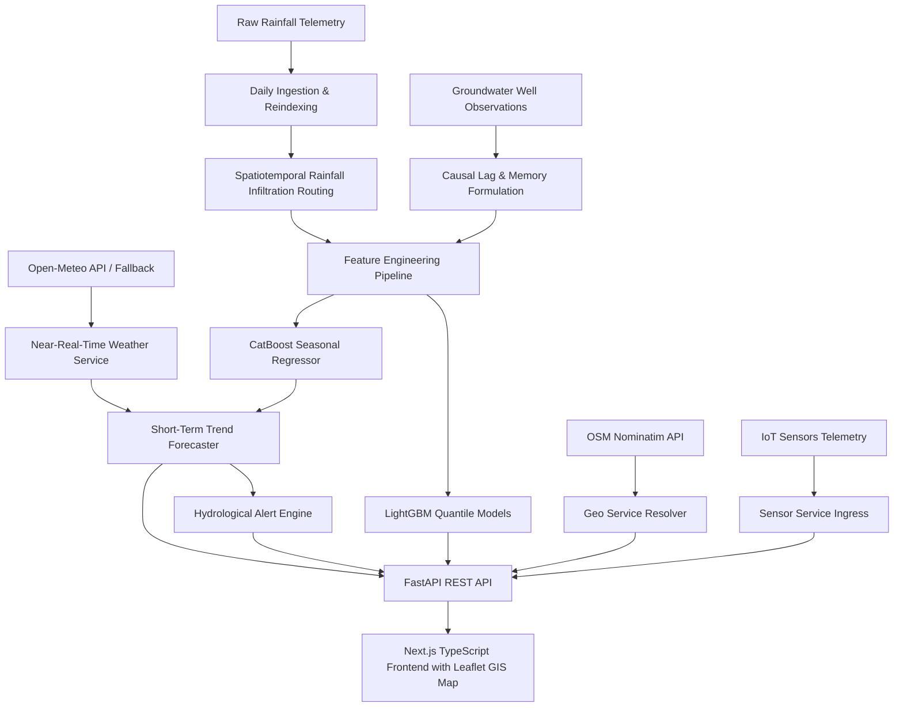

# NEERA: Spatiotemporal Groundwater Forecasting & Near-Real-Time Alerting System

NEERA is a machine learning-driven hydrology intelligence platform designed to forecast and monitor seasonal groundwater levels in Karnataka, India. It integrates irregular historical groundwater observations with spatiotemporally routed rainfall telemetry, live weather forecasts, and short-term trend projection models. 

The system acts as a **Drought Early Warning System** and **Hydrological Monitoring Dashboard** with real-time alert mapping, threshold evaluations, and a premium Next.js dashboard.

---

## 1. System Architecture & Methodology



### 1.1 Spatiotemporal Infiltration Routing
Precipitation telemetry is integrated over preceding 30d, 90d, and 180d windows with linear decay weights representing aquifer infiltration delays:

$$R_{\text{effective}} = \sum_{d=1}^{W} w_d \cdot P_{t-d}$$

### 1.2 Near-Real-Time Weather Service
- Integrates the free **Open-Meteo API** (current weather conditions, temperature, humidity, rainfall accumulation forecasts, and precipitation probabilities) with no API keys required.
- Implements resilient retry handling with exponential backoff and a 1-hour caching layer.
- **Robust Mock Fallback**: If the API is unreachable, a climatologically correct weather simulator generates realistic diurnal patterns based on latitude, longitude, and season.

### 1.3 Short-Term Trend Forecaster
- Combines the 7-day rolling average depletion rate, historical recharge sensitivity, and daily weather predictions.
- Projects daily water table trajectories (MBGL) for the next 3, 7, and 14 days.
- Calculates a **Groundwater Stress Score** (0–100) based on depth, rate of drawdown, and rainfall deficit.
- Estimates P10/P50/P90 confidence ranges showing projection uncertainty over time.

### 1.4 Hydrological Alert Engine
- Categorizes threat levels into: `SAFE`, `MODERATE`, `WARNING`, and `CRITICAL`.
- Upgrades severity based on absolute well depths (Warning > 30m, Critical > 50m) and depletion velocities (>1.5m drop/week).
- Generates recommended actions (e.g. borewell restrictions, drip irrigation mandates, rainwater harvesting setup) and estimates days-to-breach timelines.

---

## 2. Technical Stack & File Layout

- **Backend**: FastAPI, CatBoost, LightGBM, Pandas, Uvicorn.
- **Frontend**: Next.js 15, TypeScript, TailwindCSS, Recharts, Lucide Icons.
- **Deployment**: Docker, Docker Compose.

```
.
├── Dockerfile                  # Backend Dockerfile
├── docker-compose.yml          # Multi-service composition
├── app.py                      # FastAPI deployment endpoints
├── predict.py                  # CLI inference utility
├── requirements.txt            # Python dependencies
├── weather_service.py          # Weather service & cache logic
├── trend_forecaster.py         # Short-term projections
├── alert_engine.py             # Hydrological threshold warnings
├── data/                       # Datasets and schemas
├── scripts/                    # Research, tuning & validation scripts
├── outputs/                    # Serialized models, plots & reports
└── frontend/                   # Next.js TypeScript Dashboard
    ├── Dockerfile              # Frontend Dockerfile
    ├── src/
    │   └── app/
    │       ├── globals.css     # Base styles
    │       ├── layout.tsx      # Next.js Metadata
    │       └── page.tsx        # Dashboard Main Component
    └── package.json
```

---

## 3. Local Development Setup

### 3.1 Backend Setup
1. Create and activate a virtual environment:
   ```bash
   python3 -m venv .venv
   source .venv/bin/activate
   ```
2. Install dependencies:
   ```bash
   pip install -r requirements.txt
   ```
3. Set your weather API key (optional):
   ```bash
   export OPENWEATHER_API_KEY="your_api_key"
   ```
4. Start the FastAPI server:
   ```bash
   uvicorn app:app --port 8000 --reload
   ```

### 3.2 Frontend Setup
1. Navigate to the frontend directory:
   ```bash
   cd frontend
   ```
2. Install Node packages:
   ```bash
   npm install
   ```
3. Start the Next.js development server:
   ```bash
   npm run dev
   ```
4. Open [http://localhost:3000](http://localhost:3000) in your browser.

---

## 4. REST API Endpoints

- **`GET /health`**: Health status and model load checklist.
- **`GET /stations`**: Sorted list of all 803 unique monitoring well IDs.
- **`GET /stations/{id}/history?limit=N`**: Latest N seasonal observations.
- **`POST /predict`**: Causal seasonal forecast (supports DB lookup or custom payload).
- **`GET /api/weather?station_id=ID`**: Current weather conditions + 5-day forecast.
- **`GET /api/forecast?station_id=ID`**: Short-term 3d/7d/14d daily trajectory projection with P10/P50/P90 bands.
- **`GET /api/alerts`**: Lists all active warnings, critical stations, and depletion timelines.
- **`GET /api/risk-summary`**: Regional risk aggregates, cluster counts, and coordinate markers for Karnataka mapping.
- **`GET /api/geocode?query=QUERY`**: Resolves textual queries (cities, districts, villages, coordinates) to lat/lon using OpenStreetMap Nominatim.
- **`GET /api/resolve-station?lat=LAT&lon=LON`**: Maps coordinates to the nearest telemetry station ID using the Haversine formula and returns distance.
- **`GET /api/environmental-risk?station_id=ID`**: Retrieves derived environmental risk indicators (dry spell warnings, heatwave stress, recharge potential).
- **`POST /api/sensors/register`**: Registers a new IoT hardware telemetry sensor.
- **`GET /api/sensors/list`**: Lists all registered IoT sensor stations.
- **`GET /api/sensors/stream/{sensor_id}`**: Simulates/Retrieves the live websocket/MQTT telemetry stream for a specific IoT sensor.

---

## 5. Docker Compose Deployment

To build and launch both the backend and frontend in isolated containers:

1. Launch the stack:
   ```bash
   docker-compose up --build
   ```
2. The FastAPI backend will be available at [http://localhost:8000](http://localhost:8000).
3. The interactive intelligence dashboard will be running at [http://localhost:3000](http://localhost:3000).

---

## 6. Dashboard User Interface Features

The Next.js app provides a production-grade, climate-intelligence dark UI containing:
1. **Unified Location Search**: Users can search by city name, village, town, district, coordinates, or use **Browser Geolocation** ("Use My Location") to automatically resolve nearest stations.
2. **Interactive Leaflet GIS Map**: Full interactive map of Karnataka plotting telemetry station circles, dynamically color-coded by alert severity, with zooming, popups, and click-to-geocode reverse resolvers.
3. **Meteorological Card**: Renders current temperature, wind speed, relative humidity, and 5-day forecasts.
4. **Trajectory Charts**: Renders historical observations along with the 14-day expected trend and P10/P90 prediction bands.
5. **Real-time Alert Logs**: Details recommended water-auditing policies, depletion timelines, and extraction restriction levels.
6. **Live Telemetry Stream**: Connects to a simulated MQTT sensor feed with a live log receiver.
# NEERA
